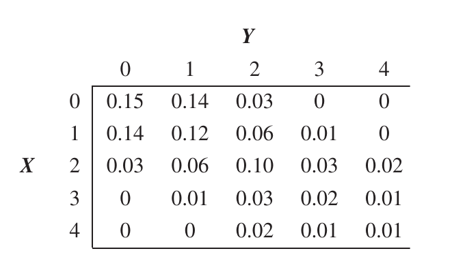

# Introduction and review

## Deterministic and Stochastic Models

### Example 1.2 (SIR model) {-}

::: {.rmdbox latex=1}

* $S_t = {}$ number of [susceptible]{.hl} people at time $t$.

* $I_t = {}$ number of [newly infected]{.hl} people at time $t$.

* $R_t = {}$ number of [recovered]{.hl} people at time $t$.

* $z = {}$ probability that a [susceptible]{.hl} individual [becomes infected]{.hl} once in contact with an infected person.

* Assume every susceptible person comes in contact with every infected person.

:::

* Probability $p$ that a susceptible individual becomes infected at a point in time:

  $$
  p_t = 1 - (1 - z)^{I_{t-1}}
  $$

  ::: {.rmdwarning latex=1}
  
  The book has the exponent as $I_{t}$, but the correct exponent is $I_{t - 1}$.
  
  In this discrete time model, we compute the number of newly infected people as a function of the number of people infected at the previous time step.
  
  :::
  

* This is because $(1 - z)^{I_{t - 1}}$ is the probability that the person has contact with all $I_{t-1}$ infected people and [does not become infected]{.hl}.

* The number of newly infected people $I_{t}$ follows a binomial distribution with $n = S_{t-1}$ and probability of success $p_t$:

  $$
  I_{t} \sim \text{Bin}(S_{t-1}, p_t)
  $$
  
  so the PMF is
  
  $$
  P(I_{t} = k) = \binom{S_{t-1}}{k} \; p_t^k \; (1 - p_t)^{S_{t-1} - k}
  $$
  
* Then the number of susceptible people at time $t$ is 

  $$
  S_{t} = S_{t-1} - I_{t}
  $$

* This simplified example does not take into account the transition from infected to recovered. 

* $I_t$ is the number of *newly* infected people at time $t$.

* In the computation, only newly infected people are contagious. It's as if people remain infected and contagious for one time step only.


#### Simulations {-}

```{r echo = FALSE}
sir <- function(i0, s0, z, steps) {
  
  i <- vector('integer', steps + 1)
  i[1] <- i0
  
  s <- vector('integer', steps + 1)
  s[1] <- s0
  
  for (t in 2:(steps + 1)) {
    
    pt <- 1 - (1 - z)^i[t - 1]
    
    i[t] <- rbinom(1, s[t - 1], pt)
    s[t] <- s[t - 1] - i[t]
    
  }
  
  df <- tibble(
    t = 0:steps,
    i = i,
    s = s
  ) 
  
  iplot <- df %>% 
    ggplot(aes(x = t)) +
      geom_line(aes(y = i), color = 'red') +
      geom_point(aes(y = i), color = 'red') +
      scale_y_continuous(limits = c(0, NA)) +
      labs(
        x = 'time',
        y = NULL,
        title = 'Newly infected individuals'
      )
  
  splot <- df %>% 
    ggplot(aes(x = t)) +
      geom_line(aes(y = s), color = 'brown') +
      geom_point(aes(y = s), color = 'brown') +
      scale_y_continuous(limits = c(0, NA)) +
      labs(
        x = 'time',
        y = NULL,
        title = 'Susceptible individuals'
      )
  
  final <- (iplot | splot) + 
    plot_annotation(
      title = TeX(
          paste0(
            'SIR:  $I_0 = $', i0,
            ',  $S_0 = $', s0,
            ',  $z = $', z
          )
        ),
      theme = theme(
        plot.background = element_rect(color = 'black'),
        plot.title = element_text(hjust = .5),
        plot.margin = margin(20, 5, 5, 5)
      )
    )
  
  final
  
}
```

```{r echo=FALSE}
i0 <- 3
s0 <- 400
z <- .004
steps <- 20

sir(i0, s0, z, steps)
```

```{r echo=FALSE}
i0 <- 3
s0 <- 400
z <- .01

sir(i0, s0, z, steps)
```

```{r echo=FALSE}
i0 <- 3
s0 <- 400
z <- .1

sir(i0, s0, z, steps)
```

```{r echo=FALSE}
i0 <- 100
s0 <- 1000
z <- .001

sir(i0, s0, z, steps)
```


## What is a stochastic process?

::: {.rmdnote latex=1}

#### Stochastic process {-}

A collection of random variables
$$
\{ X_t,\; t \in I\}
$$
where the random variables are defined on a common state space. The set $I$ is the index set.

:::


### Example 1.6 (Random walk and gambler's ruin) {-}

```{r echo=FALSE}
sim_ruin <- function(k, n, p, plays) {
  
  results <- vector('integer', plays + 1)
  results[1] <- k
  results[2:(plays + 1)] <- 
    sample(c(1, -1), plays, replace = TRUE, prob = c(p, 1 - p))
  
  results <- cumsum(results)
  last <- match(TRUE, results == 0 | results == n)
  
  if (!is.na(last))
    results[(last + 1):(plays + 1)] <- NA
  
  results
  
}
```

```{r echo=FALSE}
plot_ruin <- function(k, n, p, plays, nsims) {
  
  graphs <- vector('list', nsims)

  for (i in 1:nsims) {
    
    graphs[[i]] <-
      tibble(gain = sim_ruin(k, n, p, plays)) %>% 
      ggplot(aes(x = 1:length(gain), y = gain)) +
        geom_line() +
        geom_hline(yintercept = 0, linetype = 'dashed') +
        geom_hline(yintercept = n, linetype = 'dashed') +
        labs(
          x = NULL,
          y = NULL
        )
  }
  
  final <- wrap_plots(graphs, ncol = 3) +
    plot_annotation(
      title = TeX(
        paste0(
          'Gambler\'s ruin:  $k = {}$', k,
          ',  $n = {}$', n,
          ',  $p = {}$', p %>% round(2)
        )
      ),
      theme = theme(
        plot.background = element_rect(color = 'black'),
        plot.title = element_text(hjust = .5),
        plot.margin = margin(20, 5, 5, 5)
      )
    )

  final
   
}
```

```{r echo=FALSE, message=FALSE, warning=FALSE}
k <- 20   # Initial value
n <- 60   # Value where to stop
p <- .5  # Probability of winning
plays <- 1000
nsims <- 9

plot_ruin(k, n, p, plays, nsims)
```

```{r echo=FALSE, message=FALSE, warning=FALSE}
k <- 50   # Initial value
n <- 100   # Value where to stop
p <- .5  # Probability of winning
plays <- 1000
nsims <- 9

plot_ruin(k, n, p, plays, nsims)
```


## Monte Carlo simulation

* No notes for now.

* But @wagaman-2021-probab has a good chapter on Monte Carlo simulation.


## Conditional probabilities

::: {.rmdnote latex=1}

#### Law of total probability {-}

If $B_1, \ldots, B_k$ partition the sample space, then for any event $A$
$$
P(A) = \sum_{i=1}^k P(A \cap B_i) = \sum_{i=1}^k P(A \mid B_i)P(B_i)
$$

:::

::: {.rmdnote latex=1}

#### Conditional probability mass/density {-}

* Discrete case (mass):

  $$
  P(Y=y \mid X=x) =
  \frac{P(X=x, Y=y)}{P(X=x)}
  $$

* Continuous case (density):

  $$
  f_{Y\mid X}(y \mid x) = 
  \frac{f(x,y)}{f_X(x)}
  $$

  Conditional probability ($R \in \mathbb R$):
  $$
  P(Y \in R \mid X = x) = \int_R f_{Y \mid X}(y \mid x) \;dy
  $$

:::


### Example 1.10 (Gambler's ruin) {-}

::: {.rmdbox latex=1}

* $k = {}$ initial amount of money player A has.

* $n = {}$ total amount of money, so player B starts with $n - k$.

* $p = {}$ the probability that A wins a round.

* $q = {}$ the probability that B wins a round, so $q = 1 - p$.

* $p_k = {}$ the probability that player A wins, if A starts with $k$. [This is what we want to find.]{.hl}

:::
  
* The book only considers the case where $p = q = 1/2$.

* A more general analysis is found in @JosephK.Blitzstein989.

* A link about solving recurrent equations: http://web.cs.wpi.edu/~cs2223/d98/notes/recurrence/solve/solve.html

* Conditioning on the first step:

  $$
  p_k = p_{k+1} \cdot p \;+\; p_{k-1} \cdot q
  $$
  
* This recurrence has characteristic equation

  $$
  px^2 - x + q = 0
  $$
  
* The roots of this equation are

  $$
  x = \frac qp \quad \text{and}\quad x = 1
  $$
  
* If $p \neq q$ (i.e., A and B have different probabilities of winning a round), these roots will be distinct, so

  $$
  p_k = A \cdot 1^k + B \left( \frac qp \right)^k = 
  A + B \left( \frac qp \right)^k
  $$
  
* To find $A$ and $B$, we consider the boundary conditions:

  $$
  p_0 = 0 \quad \text{and}\quad p_n = 1
  $$

  ::: {.rmdnote latex=1}
  
  These values correspond to $p_k$ being the probability of A winning when he starts from $k$.
    
  Note that [this is the first time]{.hl} in our reasoning [where we have to decide if $p_k$ is the probability of A winning or the probability of A losing]{.hl} when he starts from $k$.
    
  If we switch the values of $p_0$ and $p_n$, then we are computing $p_k$ as the probability of A losing when he starts from $k$.
    
  The recurrence is the same (because the situation is symmetric), with only the boundary conditions being different.
  
  :::

* We finally get

  $$
  A = \frac{1}{1 - \left(\frac{q}{p}\right)^n}
  \quad\text{and}\quad
  B = -A
  $$
  
* So, [when $p \neq q$,]{.hl}

  $$
  p_k = \frac{1 - \left(\frac{q}{p}\right)^k}
  {1 - \left(\frac{q}{p}\right)^n}
  $$
  
* If $p = q$ (i.e., A and B have the same probability of winning a round), both roots will be equal to $1,$ so

  $$
  p_k = A \cdot 1^k+ B \cdot k \cdot 1^k = A + Bk
  $$

* Using the boundary conditions, we get, [when $p = q$,]{.hl}

  $$
  p_k = \frac k n
  $$

* To summarize, the probability $p_k$ that A wins starting from $k$ is

  $$
  p_k = 
  \begin{cases}
  \frac{1 - \left(\frac{q}{p}\right)^k}
  {1 - \left(\frac{q}{p}\right)^n} &\text{ if } p \neq q \\
  \frac k n  &\text{ if } p = q 
  \end{cases}
  $$


### Example 1.12 (Choosing integers) {-}

::: {.rmdbox latex=1}

* $X \sim \text{DUnif}(1, 100)$.

* $Y \sim \text{DUnif}(1, X)$.

* Find $P(Y = y \mid X = x)$.

:::

* $P(Y = y \mid X = x) = 1/x$, for $y \in \{1, \ldots, x \}$.


### Example 1.13 (Joint, marginal, conditional) {-}

::: {.rmdbox latex=1}

* [Joint]{.hl} distribution: 

  $$
  P(X = x, Y = y) = \frac{x + y}{18} \quad\text{ for }\quad (x, y) \in \{0, 1, 2\} \times \{0, 1, 2\}
  $$

* Find the [conditional]{.hl} $P(Y = y \mid X = x)$.

:::

* The conditional will be 

  $$
  P(Y = y \mid X = x) = \frac{P(X = x, Y = y)}{P(X = x)}
  $$

* To find $P(X = x)$ --- the [marginal]{.hl} distribution of $X$:

  $$
  \begin{aligned}
  P(X = x) &= \sum_{y \in \{0, 1, 2\}} P(X = x, Y = y) \\
  &= P(X = x, Y = 0) + P(X = x, Y = 1) + P(X = x, Y = 2) \\
  &= \frac{x + x + 1 + x + 2}{18} \\
  &= \frac{x + 1}{6}
  \end{aligned}
  $$

* Now

  $$
  \begin{aligned}
  P(Y = y \mid X = x) 
  &= \frac{P(X = x, Y = y)}{P(X = x)} \\
  &= \frac{\frac{x + y}{18}}{\frac{x + 1}{6}} \\
  &= \frac{x + y}{3(x + 1)}
  \end{aligned}
  $$


### Example 1.15 (Continuous RVs) {-}

::: {.rmdbox latex=1}

* Joint density

  $$
  f(x, y) = e^{-x} \quad \text{for}\quad 0 < y < x < \infty
  $$

* Find $P(Y < 2 \mid X = 5)$.

:::

* Just for fun, here is an [interactive]{.hl} graph of $f(x, y) = e^{-x}$ in part of this domain:

    ```{r echo=FALSE, message=FALSE}
    U <- c(
      0.732903778553009, 0.320359438657761, -0.600183129310608, 0,
      -0.680093824863434, 0.321718066930771, -0.658762276172638, 0,
      -0.0179509744048119, 0.89099109172821, 0.453663349151611, 0, 
      0, 0, 0, 1
    )
    
    UM <- matrix(U, nrow = 4)
    
    par3d(
      userMatrix = UM
    )

    persp3d(
      function(x, y) { 
        ifelse(y < x, exp(-x), NA)
      },
      xlim = c(0, 6),
      ylim = c(0, 6),
      col = 'blue',
      alpha = .4,
      zlab = ''
    )
    ```

* The pdf of the [conditional]{.hl} RV $Y \mid X$ will be

  $$
  f_{Y \mid X} \; (y \mid x) = \frac{f(x, y)}{f_X(x)}
  $$

  ::: {.rmdnote latex=1}
  
  We write $f_{Y \mid X} \; (y \mid x)$ to emphasize the fact that [this is a function of $y$ only]{.hl}, given a fixed value of $x$.
  
  :::
  
* To find the [marginal]{.hl} pdf $f_X(x)$:

  $$
  \begin{aligned}
    f_X(x) 
    &= \int_{-\infty}^\infty f(x,y) \; dy \\
    &= \int_{0}^x f(x,y) \; dy \\
    &= \int_{0}^x e^{-x} \; dy \\
    &= xe^{-x}
  \end{aligned}
  $$
  
* So

  $$
  \begin{aligned}
  f_{Y \mid X} \; (y \mid x) 
  &= \frac{f(x, y)}{f_X(x)} \\
  &= \frac{e^{-x}}{xe^{-x}} \\
  &= \frac1x
  \end{aligned}
  $$

* For fixed $x$, the conditional is uniform.

* This is expected, because $f(x, y) = e^{-x}$ does not depend on $y$.

* Now

  $$
  \begin{aligned}
    P(Y < 2 \mid X = 5)
    &= \int_0^2 \frac15\;dy \\
    &= \frac25
  \end{aligned}
  $$
  
* The probability corresponds to the area of the [rectangle outlined in red]{.hl} in the graph below, [after the area of the green strip is normalized to $1$]{.hl}; in other words, the rectangle outlined in red has $2/5$ of the area of the green strip.

    ```{r echo=FALSE, message=FALSE}
    U <- c(
      0.732903778553009, 0.320359438657761, -0.600183129310608, 0,
      -0.680093824863434, 0.321718066930771, -0.658762276172638, 0,
      -0.0179509744048119, 0.89099109172821, 0.453663349151611, 0, 
      0, 0, 0, 1
    )
    
    UM <- matrix(U, nrow = 4)
    
    par3d(
      userMatrix = UM
    )

    persp3d(
      function(x, y) {
        ifelse(y < x, exp(-x), NA)
      },
      xlim = c(4, 6),
      ylim = c(0, 6),
      col = 'blue',
      alpha = .4,
      zlab = ''
    )
    
    polygon3d(
      x = rep(5, 4),
      y = c(0, 2, 2, 0),
      z = c(exp(-5), exp(-5), 0, 0),
      coords = 2:3,
      add = TRUE,
      col = 'red',
      alpha = 1,
      fill = FALSE,
      lwd = 3
    )
    
    polygon3d(
      x = rep(5, 4),
      y = c(0, 5, 5, 0),
      z = c(exp(-5), exp(-5), 0, 0),
      coords = 2:3,
      add = TRUE,
      col = 'green',
      alpha = .6
    )
    ```


### Example 1.16 (Picking real numbers) {-}

::: {.rmdbox latex=1}

* $X$ is uniformly distributed on $(0, 1)$.

* $Y$ is uniformly distributed on $(0, x)$.

* Find the conditional distribution of $Y$ given $X = x$.

* Find the joint distribution of $X$ and $Y$.

* Find the marginal density of $Y$.

:::

* We know $f_X(x) = 1, \; \text{for }0 < x < 1$.

* Once $X$ gets value $x$, we have $f_{Y \mid X}(y \mid x) = 1/x, \; \text{for }0 < y < x < 1$.

* To get the joint distribution:

  $$
  \begin{aligned}
    f_{Y \mid X}(y \mid x) = \frac{f(x,y)}{f_X(x)}
    &\implies
    f(x,y) = f_{Y \mid X}(y \mid x) \cdot f_X(x) \\
    &\implies
    f(x,y) = \frac1x \cdot 1 \\
    &\implies
    f(x,y) = \frac1x
  \end{aligned}
  $$

  for $0 < y < x < 1$.

* Then, for the marginal distribution of $Y$:

  $$
  \begin{aligned}
    f_Y(y) 
    &= \int_{-\infty}^\infty f(x,y) \;dx \\
    &= \int_y^1 f(x,y) \;dx \\
    &= \int_y^1 \frac1x \;dx \\
    &= -\ln y
  \end{aligned}
  $$
  
  for $0 < y < 1$.


## Conditional expectation

::: {.rmdnote latex=1}

#### Conditional expectation of $Y$ given $X=x$ {-}

* Discrete case:

  $$
  E(Y \mid X = x) = \sum_y y\; P(Y=y \mid X=x)
  $$

* Continuous case:

  $$
  E(Y \mid X = x) = 
  \int_{-\infty}^\infty y \; f_{Y \mid X}(y \mid x) \; dy
  $$

Note this is a function of $x$.

:::


### Example 1.17 (School cafeteria registers) {-}

::: {.rmdbox latex=1}

* Let $X$ and $Y$ denote the numbers of customers at the first and second registers, resp.

* The joint probability $P(X=x, Y=y)$ is given by the table

    ```{r echo=FALSE, out.width='60%'}
    
    ```
  
* Find the expected number of people in line at the second register if there is one person at the first register.

:::

* We're looking for $E(Y \mid X = 1)$, given by

  $$
  E(Y \mid X = 1) = \sum_Y y\; P(Y = y \mid X = 1)
  $$

* In R:

    ```{r}
    y <- 0:4
    line <- c(.14, .12, .06, .01, 0)
    pyx1 <- line / sum(line)
    pyx1
    sum(y * pyx1)
    ```


### Example 1.18 (Independent Poisson RVs) {-}

::: {.rmdbox latex=1}

* $X \sim \text{Poisson}(\lambda)$.

* $Y \sim \text{Poisson}(\mu)$.

* $X \bot Y$.

* Find $P(Y \mid X + Y = n)$.

* Find $E(Y \mid X + Y = n)$.

:::

* Recall that if $X \sim \text{Poisson}(\lambda)$, then

  $$
  P(X = k) = \frac{e^{-\lambda}\; \lambda^k}{k!}
  $$

* Also, as $X \bot Y$, then $X + Y \sim \text{Poisson}(\lambda + \mu)$.

  Proof:
  
  * We must show that
  
    $$
    P(X + Y = n) = \frac{e^{-(\lambda + \mu)}\;(\lambda + \mu)^n}{n!}
    $$

  * We develop $P(X + Y = n)$ as
  
    $$
    \begin{align}
    P(X + Y = n)
    &= \sum_{i = 0}^n P(X = i)\;P(Y = n - i) \\
    &= \sum_{i = 0}^n \frac{e^{-\lambda}\; \lambda^i}{i!} \cdot 
       \frac{e^{-\mu}\; \mu^{n-i}}{(n-i)!} \\
    &= e^{-(\lambda + \mu)}\; \sum_{i = 0}^n \frac{\lambda^i}{i!} \cdot 
       \frac{\mu^{n-i}}{(n-i)!} \\
    \end{align}
    $$
    
  * Now we must show that
  
    $$
    \frac{(\lambda + \mu)^n}{n!} = \sum_{i = 0}^n \frac{\lambda^i}{i!}\cdot 
       \frac{\mu^{n-i}}{(n-i)!}
    $$
    
  * Well, by the binomial theorem,
  
    $$
    \begin{align}
    (\lambda + \mu)^n 
    &= \sum_{i=0}^n \binom{n}{i} \;\lambda^i\; \mu^{n-i} \\
    &= \sum_{i=0}^n \frac{n!}{i! (n-i)!} \;\lambda^i\; \mu^{n-i} \\
    &= n! \;\sum_{i=0}^n \frac{\lambda^i\; \mu^{n-i}}{i! (n-i)!} 
    \end{align}
    $$
    
    which makes
    
    $$
    \frac{(\lambda + \mu)^n}{n!} = \sum_{i = 0}^n \frac{\lambda^i}{i!}\cdot 
       \frac{\mu^{n-i}}{(n-i)!}
    $$

* Now...
