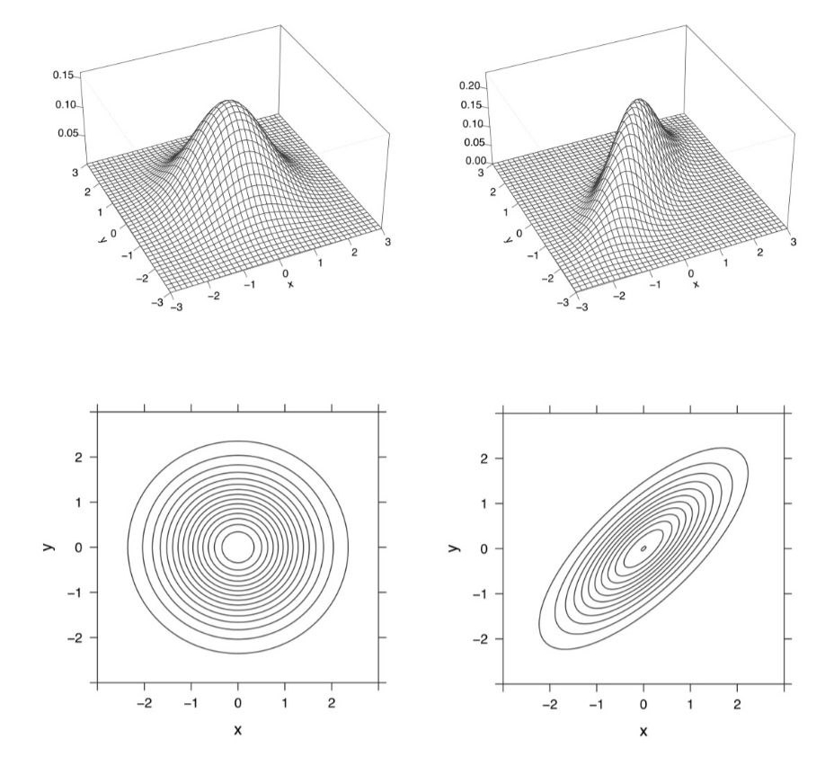

# Appendix B: Probability review {- #prob-review}

## B.4 Common probability distributions {-}

### Bivariate normal {-}

* The bivariate normal is defined here through its PDF --- which is [not]{.hl} given in its general form, but only in the case where $X \sim \mathcal N(0, 1)$ and $Y \sim \mathcal N(0, 1)$:

  $$
  f(x, y) = \frac{1}{2\pi\tau} \cdot 
  \exp\left(
    -\frac{1}{2\tau^2} \cdot (x^2 + y^2 - 2\rho xy)
  \right)
  $$

  with $\tau = \sqrt{1 - \rho^2}$.

* If these marginal distributions of $X$ and $Y$ are given, $\rho$ is still free to vary in $[-1, 1]$.

* This figure from [@JosephK.Blitzstein989] shows two bivariate normals with the same marginal distributions but different correlations $\rho_{XY}$:

    ```{r}
    
    ```

* The question is

  ::: {.rmdbox latex=1}
  
  Are both of these considered [standard]{.hl} bivariate normals?
  
  :::
  
* From [wikipedia](https://en.wikipedia.org/wiki/Multivariate_normal_distribution#Standard_normal_random_vector)^[Citing Lapidoth, Amos (2009). *A Foundation in Digital Communication*. Cambridge University Press. ISBN 978-0-521-19395-5.]:

  > A real random vector ${\displaystyle \mathbf {X} =(X_{1},\ldots ,X_{k})^{\mathrm {T} }}$ is called a standard normal random vector if all of its components ${\displaystyle X_{k}}$ are independent and each is a zero-mean unit-variance normally distributed random variable, i.e. if ${\displaystyle X_{k}\sim \ {\mathcal {N}}(0,1)}$ for all ${\displaystyle k}$.

* For any RVs $X$ and $Y$, independence implies $\rho_{XY} = 0$. So, according to this definition, the [standard bivariate normal]{.hl} has PDF

  $$
  f(x, y) = \frac{1}{2\pi} \cdot 
  \exp\left(
    -\frac{1}{2} \cdot (x^2 + y^2)
  \right)
  $$

  and corresponds only to the graphs on the left.

* The conditional distribution of $X \mid Y = y$ is ...
